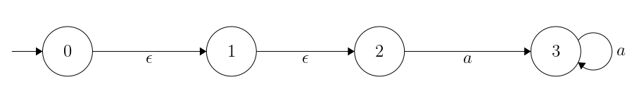
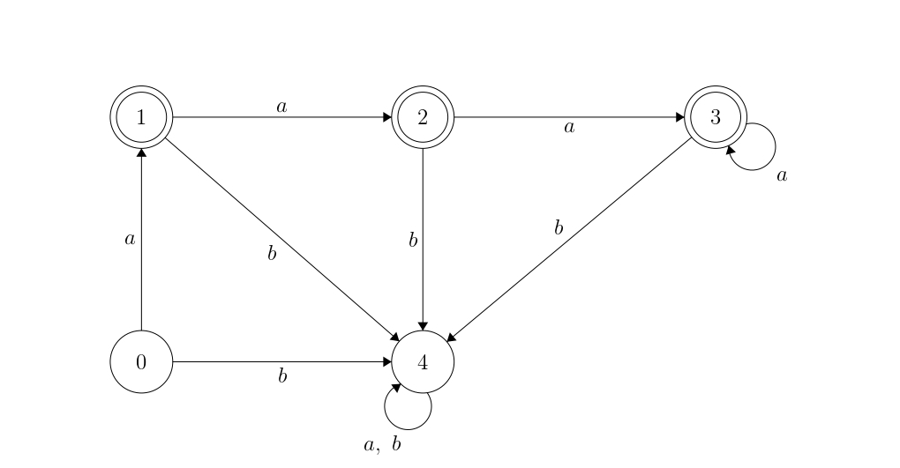
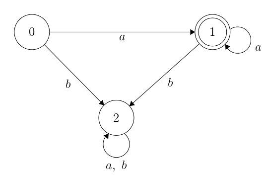

# FiniteStateMachine

## Для сборки проекта достаточно в корне:
mkdir build  
cd build  
cmake ..  
make  
Для запуска тестов можно перейти в src/bin и исполнить бинарник  
Бинарник для запуска основной программы лежать будет в build  

Если вы хотите запустить через Clion, можно открыть как проект и запустить либо run для программы либо BasicFsmTests - это запустит все тесты  

## Как задавать автомат:
- 0-е состояние всегда начальное.  
- ## Формат входных данных в файл для NFSM:
#вершин #ребер  
маска терминальных вершин (например 1 0 0 0 1 0 0) - означает, что терминальные: 0, 4)
Переходы в формате:  
src letter path - тут из src ведет стрелка в path по букве letter
При этом letter = 1 - означает, что переходы по eps.
### Пример:
4 4  
0 0 0 1  
0 1 1  
1 1 2  
2 a 3  
3 a 3  
Задает автомат:  

- ## Формат входных данных в файл для DFSM: 
#вершин(n)  
маска терминальных вершин  
x0 y0  
x1 y1  
.....  
xn yn  
где xi, yi - вершины куда есть переход из i по a, b соответственно  

### Пример:
5  
0 1 1 1 0  
1 4  
2 4  
3 4  
3 4  
4 4  
Задает автомат:

- ##### MDFSM задается аналогично DFSM, но тогда нужно гарантировать то что для данного языка он введен верно
3  
0 1 0  
1 2  
1 2  
2 2  
Задает автомат:  

# Краткое описание необходимых методов:
### NFSM:
- NFSM(filename) - делает из данного файла NFSM
- FilchEps() - стягивает eps-переходы
- bool RecognizeWord(word) - возвращает результат принадлежания word языку этого автомата
### DFSM:
- DFSM(NFSM) - конструктор из NFSM
- DFSM(filename) - конструктор из файла, при этом будьте внимательны входной автомат должен быть ПДКА
- bool RecognizeWord(word) - ...
### MDFSM
- MDFSM(DFSM) - делает из DFSM минимизируя его
- RecoginzeWord(word) - ...
- Complement() - преобразуется в дополнение
### RegularFSM
Этот класс отвечает за построение регулярки - на самом деле это не автомат)))
- Regular_automat(DFSM) - конструктор из DFSM
- MakeRegular() - преобразует себя в подобающий для дальнейшего вид - рекомендуется исполнятт всякий раз после создания
- PrintRegex() - выводит регулярку в командную строку
- PrintForLatex() - выводит ту же регулярку чтоб закинуть ее в Latex

При этом в дирректории tests/SM_examples вы можете посмотреть некоторые автоматыи как их вводить, в частности:
## Для NFSM:
|Q| |delta|
Маски для состояний(1 - завершающее, 0 - нет)  
переходы (q1, v) -> q2 в формате q1_v_q2  
## Для MDFSM
- |Q|  
Маски для состояний(1 - завершающее, 0 - нет)  
i_j   
где i, j - это переходы из данной вешины(по номеру запроса) в буквы a и b  

При этом можно обобщить на больший алфавит но те же входные данные мои не пойдут но можно прееделать очевидным образом и изменить глобальную константу

### Регулярка для моих тестовых автоматов:
1. a+
2. (a+b)
3. (1 + (a+b)*b)b(a+b)*
4. (ab+ba)*(1 + a + ba)
5. (aa)*b + ((a+b)^2)*  

Они все из наших дз к слову